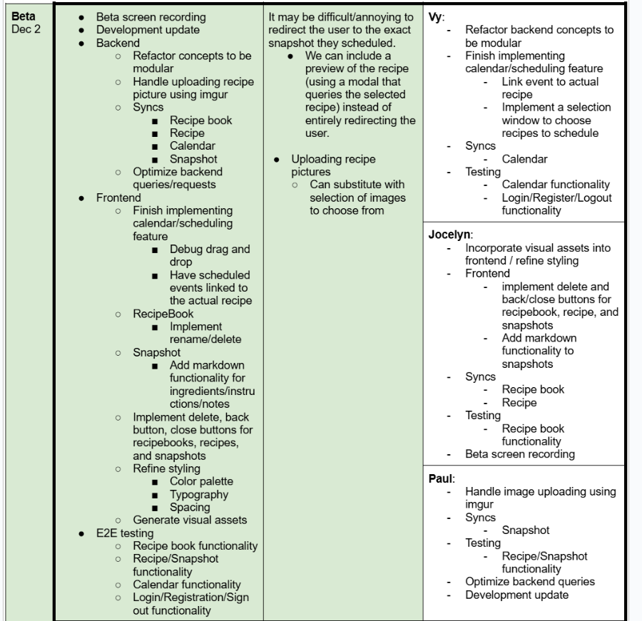

# Alpha Checkpoint Deliverables

## [Screen Recording]()

## 🅰️ **Updated** Development Plan: Alpha Checkpoint

### Progress:
- All backend concepts are implemented and have been tested. Relevant queries for each concept were implemented
- Main components of frontend are completed
  - RecipeBook, Recipes, Snapshots are functional.
    - Users can create and edit these three.
    - RecipeBook has a functional table of contents and rankings page
  - Calendar: We are able to drag and drop recipes onto certain dates.
  - Login/Register/Logout are functional

### TODOs:
- see beta row of table above

### Changes to our plan:
- see table above
