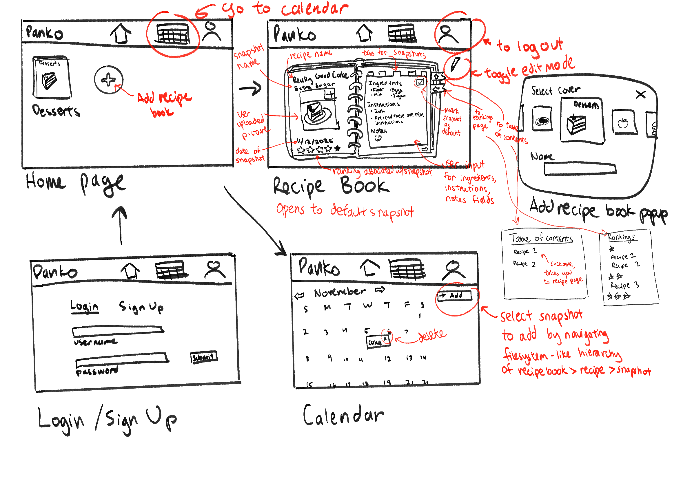
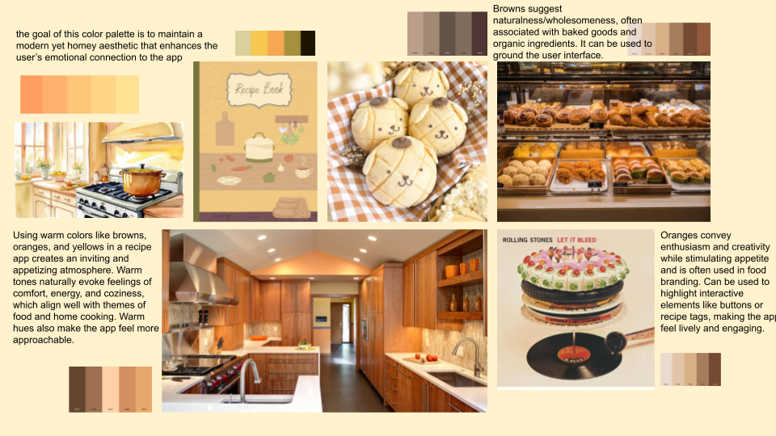
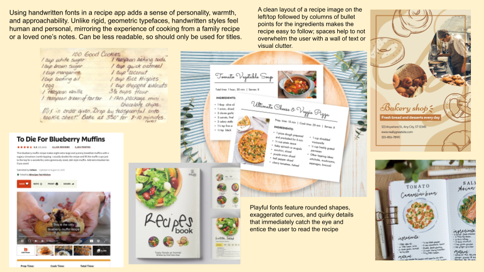

# Functional Design

## 💭 Problem Framing

See our [revised problem framing](problem-framing.md).

## ✏️ Concept Design

### Recipe Book

- purpose: provide each person with named collections of dish entries, organized through a table of contents, so they can quickly locate and choose among a manageable set of recipes instead of scanning their entire recipe history.
- principle: a person uses recipe books as focused collections of dishes that match how they plan meals. When they want to create a new collection, they define a recipe book by choosing a name that reflects the theme of that collection and associating it with themselves. Over time, as they decide which dishes belong in that collection, they add entries to the book’s table of contents, each entry linking the book to a particular dish and giving it a recognizable title. When they are deciding what to cook, they select one of their books, scan its table of contents entries to see which dishes fit their current constraints, and pick from that smaller set. Occasionally they rename a book or adjust its table of contents by adding, removing, or renaming entries so that the collections continue to match how they think about their cooking.
- states:
  - a set of `RecipeBooks` with
    - a user of type `User`
    - a set of `recipe` of type `Recipe`
    - a `name` of type `String`
- actions:
  - createRecipeBook(user: user, name: String)
    - requires: user exists
    - effects: adds recipe book with user and name and an empty set of recipes
  - editRecipeBookName(newName: String)
    - requires: recipe book exists
    - effects: changes recipe book’s name to newName
  - addRecipeToBook(recipe: Recipe, book: RecipeBook)
    - requires: recipe and recipe book exists
    - effect: adds the given recipe to the book’s set of recipes
  - removeRecipeFromBook(recipe: Recipe, book: RecipeBook)
    - requires: recipe and recipe book exists
    - effect: removes recipe from the book’s set of recipes
  - deleteRecipeBook(book: RecipeBook)
    - requires: recipe book exists
    - effects: deletes the given recipe book

### Recipes

- purpose: provide a stable identity and high-level categorization for a dish, together with a history of its recorded attempts, so that a person can quickly find that dish and see how their experience with it has evolved over time without relying on memory.
- principle: over time, a person uses recipes as named anchors for the dishes they care about. When they decide they want to be able to track a dish, they create a new recipe by giving it a name that they will recognize and adding tags that reflect how they think about it (for example, cuisine, difficulty, or occasion). Each time they want the dish’s record to reflect another cooking experience, they add a new attempt to the recipe’s history. Later, when they are deciding what to cook or looking back on past cooking, they use the recipe’s name and tags to find it quickly and then review the sequence of attempts associated with it to see how often they have made it and how their results have changed. Occasionally they update the name or tags so that the recipe remains easy to find as their tastes and habits evolve.
- state:
  - a set of `Recipes` with
    - a `name` of type `String`
    - a `description` of type `String`
    - a set of snapshots of type `Snapshot`
    - a `defaultSnapshot` of type `Snapshot`
- actions:
  - createRecipe (user: User, name: String, description: String)
    - requires: user exists
    - effect: create a new recipe with given arguments and an empty set of snapshots
  - editRecipeName(snapshot: Snapshot, newName: String, description: String): (recipe: Recipe)
    - requires: recipe exists
    - effect: edits recipe with new name and description
  - deleteRecipe (recipe: Recipe): (recipe: Recipe)
    - requires: recipe exists
    - effect: deletes the given recipe
  - addSnapshot(snapshot: Snapshot, recipe: Recipe)
    - requires: recipe and snapshot exists
    - effects: adds the snapshot the set of snapshots
  - removeSnapshot (snapshot: Snapshot, recipe: Recipe)
    - requires: recipe and snapshot exists
    - effect: removes the snapshot from the given recipe’s set of snapshots
  - setDefaultSnapshot (snapshot: Snapshot, recipe: Recipe)
    - requires: snapshot exists and is in recipe’s set of snapshots
    - effects: sets defaultSnapshot of recipe to given snapshot

### Snapshots

- purpose: record individual attempts at preparing a dish, including context and outcome, so that the cook can compare attempts, learn from variations, and see how their results change over time.
- principle: each time a user prepares a dish, they create a new snapshot that captures when it was made, any photos of the result, notes about what they did (or changed) compared to their usual approach, and how satisfied they were with the outcome. Over many cooking sessions, these snapshots accumulate into a chronological history of attempts for that dish. When the user is deciding how to make the dish again, they review the previous snapshots to see which variations turned out best and what they want to repeat or avoid, then create a new snapshot for the latest attempt to extend the history.
- state:
  - A set of `snapshots` with
    - a `user` of type `User`
    - an `ingredientsList` of type `String`
    - an `instructions` of type `String`
    - a `note` of type `String`
    - a `ranking` of type `Number`
    - a `subname` of type `String`
    - a set of `pictures` of type `FilePath`
    - a `date` of type `Date`
- actions:
  - createSnapshot (ingredientsList: String, subname: String, pictures: Path, date: Date, instructions: String, note: String, ranking: Ranking): (snapshot: Snapshot)
    - requires: ranking is between 1 and 5
    - effects: creates a new snapshot with the given arguments
  - editSnapshot (ingredientsList: String, subname: String, pictures: Path, date: Date, instructions: String, note: String, ranking: Ranking):(snapshot: Snapshot)
    - requires: snapshot exists
    - effect: updates the snapshot with the given edits
  - deleteSnapshot(snapshot: Snapshot):(snapshot: Snapshot)
    - requires: snapshot exists
    - effect: deletes the given snapshot

### Calendar

- purpose: let a person commit planned dishes to specific dates so they can see at a glance what is coming up and avoid forgetting what they intended to cook on a given day.
- principle: when a person decides they want to make a particular dish on a specific day, they create a calendar entry that links that plan to the chosen date. As days pass, they look at the calendar to see which dishes are scheduled on upcoming dates and adjust entries when plans change by moving, updating, or deleting them. After they complete a planned dish on its day, they can mark the corresponding entry as done or clear it, so that the calendar remains an accurate view of what is still planned rather than a log of past events.
- state:
  - a set of ScheduledRecipes
    - a `user` of type `User`
    - a `snapshot` of type `Snapshot`
    - a `date` of type `Date`
- actions:
  - assignSnapshotToDate(snapshot: Snapshot, date: Date)
    - requires: snapshot exists
    - effects: adds snapshot to ScheduledRecipes with given date
  - deleteScheduledRecipe(scheduledRecipe: ScheduledRecipe)
    - requires: scheduledRecipe exists
    - effects: deletes the given scheduledRecipe

## 🧭 User Journey

The user opens the app feeling overwhelmed by what to cook and starts by opening a recipe book instead of scrolling through an undifferentiated list of everything they have ever made. Inside that book, a concise table of contents with titles, tags, times, and ratings helps them quickly narrow down to one recipe that fits their time and energy. On the recipe view, they skim the timeline of past snapshots of their attempts at the recipe with dates, notes, and ratings to recall which variation worked best, then cook using those cues and log a new snapshot that records how this attempt turned out for future iterations. Wanting to avoid the same stress later in the week, they select several recipes and use the calendar to schedule them so that, during the week, they can simply open the app, see what is scheduled, follow the linked recipe, and record another snapshot, gradually building a structured history that reduces decision fatigue and prevents good meals from being forgotten.

## 🎨 UI Sketches

## 🔍 Visual Design Study

## ✅ Design Summary

The design uses four concepts that together support iterative cooking and reduce decision fatigue. **RecipeBook** lets a user group dishes into named collections with a table of contents, so when they feel stuck about what to cook they can open a focused book instead of scanning their entire history. Each entry leads to a **Recipe**, which is the stable anchor for a dish and holds its core description plus a set of associated snapshots. **Snapshot** records a single attempt at a dish, with date, ingredients/instructions actually used, photos, and notes. Over time, this gives each recipe a timeline of concrete iterations that the user can review before cooking again. The **Calendar** links planned cooking to specific dates by assigning snapshots (planned or existing) to days, so the user can plan future iterations in advance and simply follow what is on the calendar rather than re-deciding from scratch every night. In the main journey, the user opens a recipe book to narrow options, picks a recipe, reviews its snapshots to choose how to make it, records a new snapshot after cooking, and then uses the calendar to schedule upcoming dishes, gradually building a structured, revisitable history of their cooking. The design also connects to the ethical concerns raised in the analysis. RecipeBooks and recipe-level organization help manage the accumulation of many dishes over time, so users can work within smaller, meaningful subsets instead of facing an overwhelming list. The Calendar supports lifestyle changes toward more planned home cooking by letting users set up future attempts in advance, which lowers day-to-day friction. Sustainability benefits can emerge from repeatedly iterating on existing recipes and planning meals ahead rather than chasing constant novelty.

## 🚀 Development Plan

[image to be inserted later]
