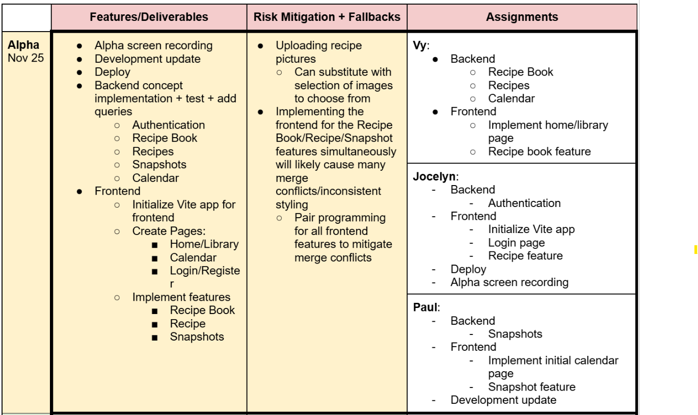
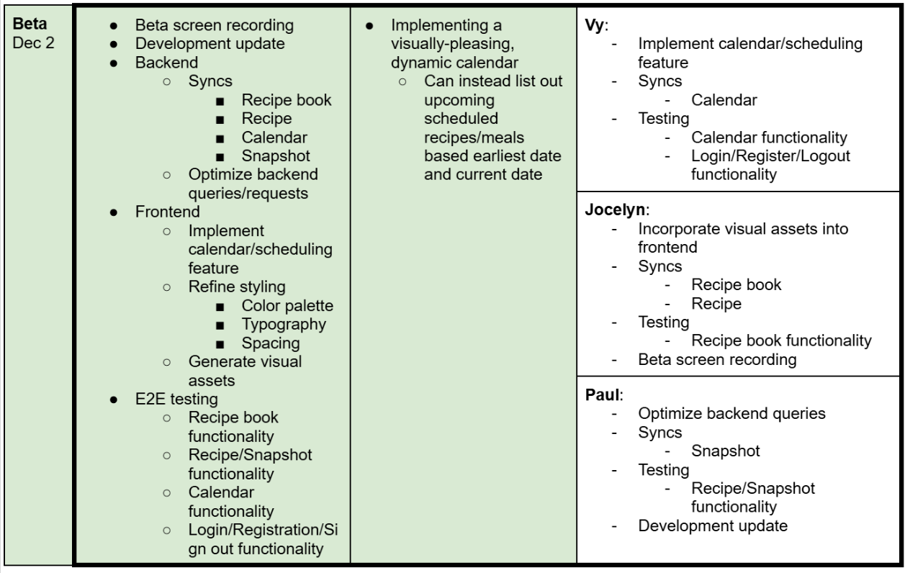

# Functional Design

## 💭 Problem Framing

See our [revised problem framing](problem-framing.md).

## Pitch
## ✏️ Concept Design

### Recipe Book

- purpose: provide each person with named collections of dish entries, organized through a table of contents, so they can quickly locate and choose among a manageable set of dishes instead of scanning their entire cooking history.
- principle: a person uses recipe books as focused collections of dishes that match how they plan meals. When they want to create a new collection, they define a recipe book by choosing a name that reflects the theme of that collection and associating it with themselves. Over time, as they decide which dishes belong in that collection, they add entries to the book’s table of contents, each entry linking the book to a particular dish and giving it a recognizable title. When they are deciding what to cook, they select one of their books, scan its table of contents entries to see which dishes fit their current constraints, and pick from that smaller set. Occasionally they rename a book or adjust its table of contents by adding, removing, or renaming entries so that the collections continue to match how they think about their cooking.
- states:
  - a set of `RecipeBooks` with
    - a user of type `User`
    - a set of `dish` of type `Dish`
    - a `name` of type `String`
- actions:
  - createRecipeBook(user: user, name: String)
    - requires: user exists
    - effects: adds recipe book with user and name and an empty set of dishes
  - editRecipeBookName(newName: String)
    - requires: recipe book exists
    - effects: changes recipe book’s name to newName
  - addDishToBook(dish: Dish, book: RecipeBook)
    - requires: dish and recipe book exists
    - effect: adds the given dish to the book’s set of dishes
  - removeDishFromBook(dish: Dish, book: RecipeBook)
    - requires: dish and recipe book exists
    - effect: removes dish from the book’s set of dishes
  - deleteRecipeBook(book: RecipeBook)
    - requires: recipe book exists
    - effects: deletes the given recipe book

### Dishes

- purpose: provide a stable identity and high-level categorization for a dish, together with a history of its recorded attempts, so that a person can quickly find that dish and see how their experience with it has evolved over time without relying on memory.
- principle: over time, a person uses named dishes as anchors for the meals they care about. When they decide they want to be able to track a dish, they create a new dish entry by giving it a name that they will recognize and adding tags that reflect how they think about it (for example, cuisine, difficulty, or occasion). Each time they want the dish’s record to reflect another cooking experience, they add a new recipe attempt to the dish’s history. Later, when they are deciding what to cook or looking back on past cooking, they use the dish’s name and tags to find it quickly and then review the sequence of associated recipes to see how often they have made it and how their results have changed. Occasionally they update the name or tags so that the dish remains easy to find as their tastes and habits evolve.
- state:
  - a set of `Dishes` with
    - a `name` of type `String`
    - a `description` of type `String`
    - a set of `recipes` of type `Recipe`
    - a `defaultRecipe` of type `Recipe`
- actions:
  - createDish (user: User, name: String, description: String):(dish: Dish)
    - requires: user exists
    - effect: create a new dish with given arguments and an empty set of recipes
  - editDishName(dish: Dish, newName: String, description: String): (dish: Dish)
    - requires: dish exists
    - effect: edits dish with new name and description
  - deleteDish (dish: Dish): (dish: Dish)
    - requires: dish exists
    - effect: deletes the given dish
  - addRecipe(recipe: Recipe, dish: Dish)
    - requires: dish and recipe exists
    - effects: adds the recipe to the dish’s set of recipes
  - removeRecipe (recipe: Recipe, dish: Dish)
    - requires: dish and recipe exists
    - effect: removes the recipe from the given dish’s set of recipes
  - setDefaultRecipe (recipe: Recipe, dish: Dish)
    - requires: recipe exists and is in dish’s set of recipes
    - effects: sets defaultRecipe of dish to given recipe

### Recipes

- purpose: record individual attempts at preparing a dish, including context and outcome, so that the cook can compare attempts, learn from variations, and see how their results change over time.
- principle: each time a user prepares a dish, they create a new recipe entry that captures when it was made, any photos of the result, notes about what they did (or changed) compared to their usual approach, and how satisfied they were with the outcome. Over many cooking sessions, these recipes accumulate into a chronological history of attempts for that dish. When the user is deciding how to make the dish again, they review the previous recipes to see which variations turned out best and what they want to repeat or avoid, then create a new recipe entry for the latest attempt to extend the history.
- state:
  - A set of `recipes` with
    - a `user` of type `User`
    - an `ingredientsList` of type `String`
    - an `instructions` of type `String`
    - a `note` of type `String`
    - a `ranking` of type `Number`
    - a `subname` of type `String`
    - a set of `pictures` of type `FilePath`
    - a `date` of type `Date`
    - a `dish` of type `Dish`
- actions:
  - createRecipe (ingredientsList: String, subname: String, pictures: Path, date: Date, instructions: String, note: String, ranking: Ranking, dish: Dish): (recipe: Recipe)
    - requires: ranking is between 1 and 5
    - effects: creates a new recipe entry with the given arguments
  - editRecipe (recipe: Recipe, ingredientsList: String, subname: String, pictures: Path, date: Date, instructions: String, note: String, ranking: Ranking):(recipe: Recipe)
    - requires: recipe exists
    - effect: updates the recipe with the given edits
  - deleteRecipe(recipe: Recipe):(recipe: Recipe)
    - requires: recipe exists
    - effect: deletes the given recipe entry
  - deleteAllRecipesForDish(dish: Dish)
    - requires: True
    - effect: deletes all recipes associated with the given dish

### Calendar

- purpose: let a person commit planned dishes to specific dates so they can see at a glance what is coming up and avoid forgetting what they intended to cook on a given day.
- principle: when a person decides they want to make a particular dish on a specific day, they create a calendar entry that links that plan to the chosen date.
- state:
  - a set of ScheduledRecipes
    - a `user` of type `User`
    - a `recipe` of type `Recipe`
    - a `date` of type `Date`
- actions:
  - assignRecipeToDate(recipe: Recipe, date: Date)
    - requires: recipe exists
    - effects: adds recipe to ScheduledRecipes with given date
  - deleteScheduledRecipe(scheduledRecipe: ScheduledRecipe)
    - requires: scheduledRecipe exists
    - effects: deletes the given scheduledRecipe
  - deleteAllScheduledRecipesWithRecipe(recipe:Recipe)
    - requires: True
    - effects: finds all ScheduledRecipes associated with the given recipe and deletes them

## 🔗 Syncs

### sync validateCreateBook
**When** `Request.createBook(user, token, name)`\
**Where** `Authentication.validateToken(user,token)` is True\
**Then** `RecipeBook.createRecipeBook(user, name)`
----
### sync createNewDish
**When** `Request.createNewDish(user, token, name, description, book)`
**Where**`Authentication.validateToken(user, token)` is True\
**Then** `Dishes.createDish(user, name, description)`

### sync addNewDishToBook
**When** `Request.createNewDish(user, token, name, description, book)`\
`Dishes.createDish(user, name, description): (dish: Dish)`\
**Then** `RecipeBook.addDishToBook(dish, book)`

---

### sync removeRecipeFromDish
**When** `Request.removeRecipeAttempt(user, token, recipe, dish)`\
`Authentication.validateToken(user,token)`\
`Recipe.deleteRecipe(recipe): (recipe: Recipe)`\
**Then** `Dishes.removeRecipe(recipe: Recipe, dish: Dish)`

### sync removeRecipeFromCalendar
**When** `Request.removeRecipeAttempt(user, token, recipe, dish)`\
**Where** `Authentication.validateToken(user,token)` is True\
**Then** `Calendar.deleteAllScheduledRecipesWithRecipe(recipe: recipe)`

**Note:** Clean up calendar entries with given recipe when it is deleted

---
### sync removeDishFromBook
**When** `Request.removeDish(user, token, dish, book)`\
`Authentication.validateToken`\
`Dishes.deleteDish(dish): (dish: Dish)`\
**Then** `RecipeBook.removeDishFromBook(dish: Dish, book: RecipeBook)`

### sync deleteAllRecipesFromDish
**When** `Request.removeDish(user, token, dish, book)`\
`Authentication.validateToken(user,token):`\
`Dishes.deleteDish(dish): (dish: Dish)`\
**Then** `Recipe.deleteAllRecipesForDish(dish: Dish)`

## 🧭 User Journey

The user opens the app feeling overwhelmed by what to cook and starts by opening a recipe book instead of scrolling through an undifferentiated list of everything they have ever made. Inside that book, a concise table of contents with titles, tags, times, and ratings helps them quickly narrow down to one dish that fits their time and energy. On the dish view, they skim the timeline of past recipes (individual attempts) with dates, notes, and ratings to recall which variation worked best, then cook using those cues and log a new recipe entry that records how this attempt turned out for future iterations. Wanting to avoid the same stress later in the week, they select several dishes and use the calendar to schedule them so that, during the week, they can simply open the app, see what is scheduled, follow the linked dish, and record another recipe entry, gradually building a structured history that reduces decision fatigue and prevents good meals from being forgotten.

## 🎨 UI Sketches

## 🔍 Visual Design Study

## ✅ Design Summary

The design uses four concepts that together support iterative cooking and reduce decision fatigue. **RecipeBook** lets a user group dishes into named collections with a table of contents, so when they feel stuck about what to cook they can open a focused book instead of scanning their entire history. Each entry leads to a **Dish**, which is the stable anchor for a meal and holds its core description plus a set of associated recipe attempts. **Recipe** records a single attempt at a dish, with date, ingredients/instructions actually used, photos, and notes. Over time, this gives each dish a timeline of concrete iterations that the user can review before cooking again. The **Calendar** links planned cooking to specific dates by assigning recipes (planned or existing) to days, so the user can plan future iterations in advance and simply follow what is on the calendar rather than re-deciding from scratch every night. In the main journey, the user opens a recipe book to narrow options, picks a dish, reviews its recipes to choose how to make it, records a new recipe after cooking, and then uses the calendar to schedule upcoming dishes, gradually building a structured, revisitable history of their cooking. The design also connects to the ethical concerns raised in the analysis. RecipeBooks and dish-level organization help manage the accumulation of many dishes over time, so users can work within smaller, meaningful subsets instead of facing an overwhelming list. The Calendar supports lifestyle changes toward more planned home cooking by letting users set up future attempts in advance, which lowers day-to-day friction. Sustainability benefits can emerge from repeatedly iterating on existing dishes and planning meals ahead rather than chasing constant novelty.

## 🚀 Initial Development Plan

## 🅰️ **Updated** Development Plan: Alpha Checkpoint

